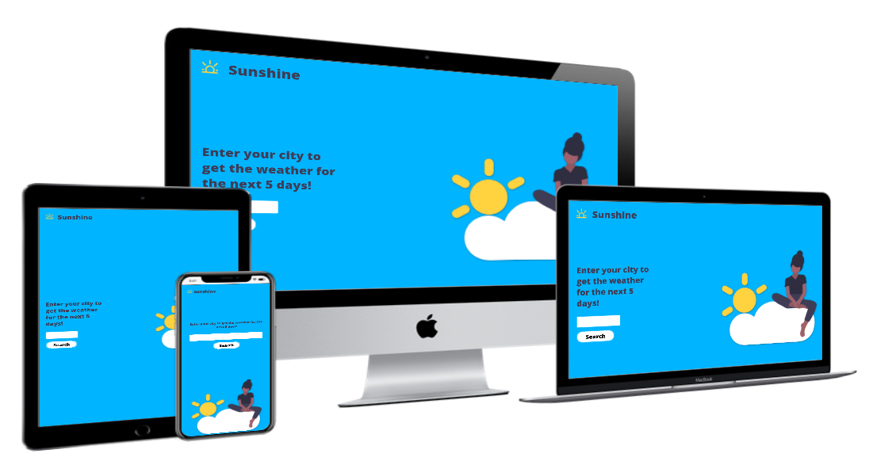

# Sunshine - Weather App

This website was designed as my second Milestone project, as part of the Fullstack Web Developer Course with Code Institute.

Sunshine allows users to get a 5 day summary of the weather, for their chosen location, as well as a more detailed outline of the weather for any day in the next 5 days.

### Mockups

### User Stories

The purpose of the site is to allow quick access to an overview of the weather for the next 5 days, with a brief summary of the weather for each day.

- As a user, I want to see what the weather will be like in my chosen location.
- As a user, I want to see a detailed summary of the weather on any chosen day within the next 5 days.

### Wireframes

## Features

1. Landing page with description of what the site does
2. Search box, and button to enter desired location
3. Weather card for each day showing a summary of the weather.
4. button to display a more detailed breakdown of the weather for a chose day.
5. option to showing weather for day or night.

## Technologies Used

- [HTML5](https://www.w3schools.com/html/)
- [CSS](https://www.w3.org/Style/CSS/Overview.en.html)
- [VSCode Insiders](https://code.visualstudio.com/) - IDE used for all code editing
- [GitHub](https://github.com) - Version control and hosting
- [Figma](https://www.figma.com) - Wireframes, and image editing
- [Google Fonts](https://fonts.google.com/) - Open Sans font
- [DayJS](https://github.com/iamkun/dayjs) - Used for parsing date information into a human readable format.
- [Accuweather API](https://developer.accuweather.com/) - Source of weather data used in project

## Testing

## Deployment

I deployed the site using Netlify.

Steps taken -

1. Navigate to Repo, and select settings
2. Scroll to GitHub Pages section.
3. Click on source dropdown and choose appropriate branch.
4. A link to the newly deployed site is then displayed at the top of the section.

To Deploy my project locally -

1. Navigate to the repo `https://github.com/ehackett/milestone-2---Sunshine`.
2. In the top right of the page there is a green "Code" button.
3. On pressing this a number of options are given - Download a zip file, open using github desktop application, or clone using HTTPS or SSH.
4. To clone, open your terminal, and navigate to the directory you want to clone the repo into.
5. Enter the following - `git clone https://github.com/ehackett/milestone-2---Sunshine.git`
6. The project can now be opened using the Code Editor of your choice

## Credits

### Media

- Image on landing page taken from [unDraw](https://undraw.co/)
- Weather icons from [Accuweather API](https://developer.accuweather.com/weather-icons)

### Acknowledgements

- Code Institute for allowing me to pursue my interest in Web Development, and for excellent learning materials
- Jonas Schmedtmann for a great course to supplement my learning: [The Complete JavaScript Course 2020](https://www.udemy.com/course/the-complete-javascript-course/)
- AccuWeather for an easy to use API
